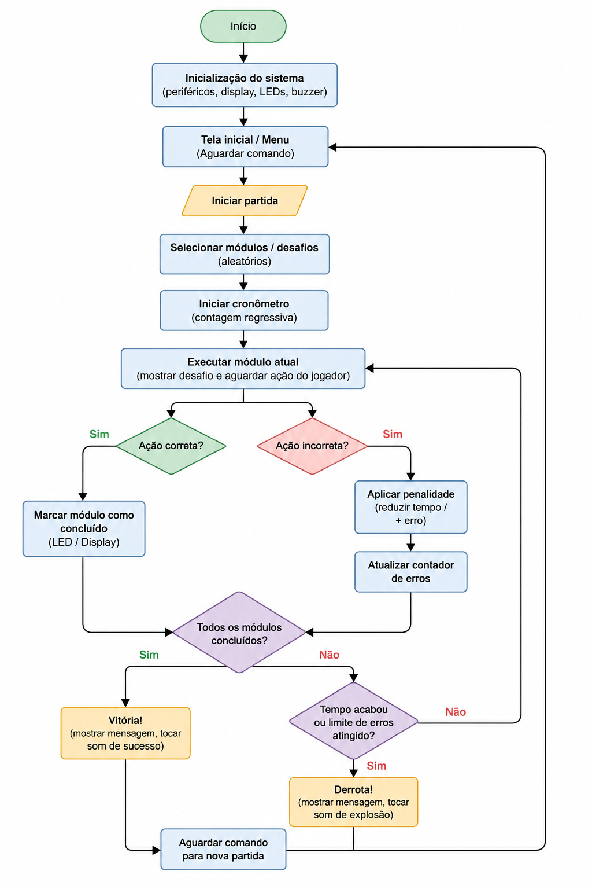

# Projeto_LabProc_Grupo-AA
O **\<nome do projeto\>** é um jogo implementado em uma **Raspberry Pi 3**, inspirado em **Keep Talking and Nobody Explodes**.

O jogo foi projetado para ser jogado por duas ou mais pessoas. Um dos jogadores assume o papel de **desarmador** da bomba, enquanto os demais atuam como **especialistas**, consultando o manual de desarmamento para fornecer as instruções necessárias.

Cada bomba é composta por múltiplos módulos independentes. Para desarmá-la, o jogador deve completar todos os módulos antes que o número máximo de erros permitidos seja atingido.

O diferencial do projeto é sua interface física, conectada à Raspberry Pi, que proporciona uma experiência mais imersiva e interativa do que uma interface exclusivamente digital.

A Raspberry Pi permite executar toda a lógica do jogo, gerenciar a interface física, reproduzir áudio, controlar múltiplos periféricos simultaneamente e oferecer uma arquitetura mais flexível para expansão do projeto.

## Especificação de requisitos
| Requisito | Tipo | Teste |
|-----------|------|--------|
| O jogo deve ter uma interface gráfica por meio do pygame. | RF | Rodar a interface. |
| O sistema deve permitir iniciar uma nova partida. | RF | Pressionar o botão de início e verificar se uma nova partida é iniciada. |
| O sistema deve exibir um cronômetro regressivo durante a partida. | RF | Iniciar uma partida e verificar se o tempo é decrementado corretamente. |
| O sistema deve validar as ações do jogador nos desafios. | RF | Realizar ações corretas e incorretas e verificar se o sistema identifica corretamente cada uma delas. |
| O sistema deve contabilizar erros e aplicar uma penalidade ao jogador. | RF | Cometer um erro e verificar se o contador aumenta e a penalidade é aplicada. |
| O sistema deve encerrar a partida com vitória (todos os módulos concluídos) ou derrota (tempo esgotado ou limite de erros). | RF | Resolver todos os desafios ou deixar o tempo acabar e verificar se o resultado correto é exibido. |
| O jogo deve ser suportado pela Raspberry Pi. | RNF | Rodar o jogo na Raspberry e verificar seu desempenho. |
| O sistema deve utilizar os periféricos do kit Freenove (botões, LEDs, display, buzzer e joystick). | RNF | Verificar que todos os periféricos previstos funcionam corretamente durante a partida. |
| O sistema deve responder às ações do jogador em até 200 ms. | RNF | Medir o tempo entre uma entrada do jogador e a resposta do sistema. |
| O software deve possuir arquitetura modular, permitindo adicionar novos desafios facilmente. | RNF | Verificar que cada desafio está implementado em um módulo independente. |
| O projeto deve possuir código-fonte versionado e documentação no GitHub. | RNF | Verificar a existência do repositório, histórico de commits e arquivo README.md. |

## Arquitetura proposta

### Fluxograma

---

### Arquitetura de Software

A arquitetura proposta é baseada em um **Raspberry Pi 3** como unidade central de processamento, responsável por executar toda a lógica do jogo, controlar o cronômetro, validar as ações do jogador e gerenciar os periféricos conectados. Utilizaremos o pygame que é uma biblioteca gratuita usada para criar jogos de forma mais simples e que pode ser suportada pela Raspberry Pi 3.

O software será dividido em módulos para facilitar o desenvolvimento e a manutenção. Um controlador principal será responsável por:

- Inicializar o sistema;
- Selecionar os desafios da partida;
- Controlar o tempo;
- Verificar as condições de vitória ou derrota;
- Coordenar a comunicação com os demais módulos.

Cada desafio será implementado como um módulo independente, permitindo que novos desafios sejam adicionados ou modificados sem impactar o restante do sistema.

---

### Arquitetura de Hardware

O Raspberry Pi 3 será conectado aos periféricos do kit Freenove por meio dos pinos GPIO, utilizando também interfaces I2C quando necessário.

Os principais periféricos previstos para o projeto são:

- **Display LCD/OLED:** exibição do tempo restante e mensagens da partida.
- **Botões e Joystick:** interação do jogador com os desafios.
- **LEDs:** indicação visual do estado dos módulos (ativo, concluído ou erro).
- **Buzzer:** feedback sonoro para início da partida, erros, vitória e derrota.
- **Potenciômetro:** utilizado em um dos desafios que exige ajuste de um valor específico.
- **Sensor ultrassônico (opcional):** utilizado em desafios baseados na distância entre o jogador e o sensor.
- **Teclado matricial (Keypad):** utilizado em um dos desafios.

---

### Comunicação

Os componentes digitais, como botões, LEDs e buzzer, serão conectados diretamente aos GPIOs do Raspberry Pi.

Caso sejam utilizados displays ou conversores analógico-digitais, a comunicação será realizada pelos protocolos **I2C** ou **SPI**, ambos suportados pelo Raspberry Pi 3 e amplamente utilizados em sistemas embarcados.

---

### Justificativa da Arquitetura

A arquitetura centralizada foi escolhida por simplificar o desenvolvimento do projeto, concentrando toda a lógica em um único dispositivo. Além disso, a organização modular facilita a implementação individual de cada desafio, permitindo que diferentes integrantes da equipe trabalhem em módulos distintos e que novos desafios sejam adicionados futuramente sem grandes alterações na estrutura do sistema.

## Cronograma

| Semana | Entregas |
| ------ | ---------------------------------------------------------------------------------------------------- |
| 1      | Idealização do projeto, requisitos funcionais e não funcionais.                                      |
| 2      | Interface básica, implementação de inputs por botões e joysticks, e implementação de alguns módulos. |
| 3      | Implementação do restante dos módulos e relatório final.                                             |
| 4      | Correção de bugs e implementação de features adicionais.                                             |

## Link relatório com motivação:
https://docs.google.com/document/d/11jxg66rxFvP1fYSW8-Ed31L4WivpC0GDYvS7KKQRi8A/edit?tab=t.0

## Desenvolvedores:
- Enzo Goro - 13553825
- Paulo Yamaguti - 12554612
